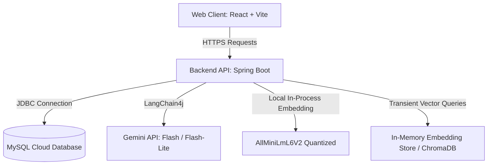

# CodeNova AI 🚀

An AI-powered Coding Mentor and Interview Preparation Platform designed to accelerate programming education and software interview readiness. Built with a production-grade, secure React + Spring Boot architecture, integrating local quantized embedding models, RAG document indexing, and the Gemini API.

---

## 🏗️ Architecture & Flow



---

## 🛠️ Locked Tech Stack

### Frontend
* **Core**: React 18, TypeScript, Vite
* **Styling**: Tailwind CSS, Lucide React Icons
* **Routing**: React Router DOM (with protected route token guards)
* **APIs**: Axios client (with JWT request/response interceptors)

### Backend
* **Core**: Java 21, Spring Boot 3.2.x, Maven
* **Security**: Spring Security, JWT (stateless session authentication)
* **AI Integration**: LangChain4j, Gemini API (Flash/Flash-Lite models)
* **Embeddings**: Local `AllMiniLmL6V2QuantizedEmbeddingModel`
* **Relational DB**: MySQL (Flyway migration schemas)
* **Vector DB**: ChromaDB / Local In-Memory Vector Store

---

## 🌟 Key Features & AI Integrations

### 0. OpenRouter Fallback Model Chain 🤖
* **AI Job**: Ensures high availability of the AI models.
* **Architecture**: Employs `FallbackChatLanguageModel` executing failover attempts down a priority model chain (`DeepSeek R1` -> `Qwen 3` -> `Llama 3.3` -> `Gemma`). If rate-limited (HTTP 429) or service is offline, the backend catches exceptions and retries with the next model, bypassing intermediate handlers by using a custom root-level `AiProviderUnavailableException`.

### 1. AI Coding Mentor (Chat) 💬
* **AI Job**: Serves as a technical programming tutor.
* **Architecture**: Loads last 10 messages from MySQL chat history dynamically, passes them to Gemini for stateless conversation memory, and limits users to 5 requests per minute via IP rate limiting.

### 2. Code Analysis Suite 💻
* **Line Explainer**: Breaks down complex algorithms block-by-block with concise comments.
* **Big-O Analyzer**: Traces inputs to calculate Time and Space complexity bounds.
* **AI Debugger**: Analyzes stack trace inputs to diagnose bugs, return root causes, and output complete code patches.
* **Autocomplete Suggestor**: Feeds the editor with next-line code predictions limited to 30 output tokens for speed.

### 3. Practice Hub 🎯
* **AI Job**: Dynamically designs custom programming tasks by topic (e.g. Recursion, Algorithms) and difficulty level.
* **Grader**: Validates user-submitted code against target logic, awards XP points, and updates level achievements in MySQL. Users can also request AI-generated hints.

### 4. Mock Interview Prep 👔
* **AI Job**: Simulates full technical interviews for roles like "Backend Engineer".
* **Grader**: Generates role-specific questions and evaluates typed answers to output strengths, gaps, scores, and custom improvement plans.

### 5. SQL Mentor 🗄️
* **AI Job**: Translates English prompts into SQL queries against a schema.
* **Reviewer**: Evaluates user SQL queries for syntax errors, check logic against the prompt, and logs the history.

### 6. RAG Knowledge Base 📚
* **AI Job**: Indexes uploaded PDF notes or slides and grounds AI responses in them.
* **Architecture**: Uses `Apache PDFBox` to extract text, splits it into 500-character segments with 100-character overlaps, generates local embeddings, and searches the vector store for top-3 relevant segments.
* **Prompt Grounding**: The system prompt forces the model to cite page numbers (e.g., `[Page 3]`) and answer strictly from context. If the fact is not in the context, it must return exactly: *"Information not found in this document."*

### 7. Progress Tracker 📈
* **AI Job**: Tracks and displays progress metrics and weekly code execution charts.
* **Roadmap**: Passes weekly activity metrics to Gemini to generate on-demand study recommendations.

### 8. Resume ATS Analyzer 📄
* **AI Job**: Scans resume files to calculate keyword match densities and generates priority containerization (Docker) or caching (Redis) roadmap steps.

### 9. Analytics Dashboard 📊
* **AI Job**: Computes overall placement readiness scores based on coding problems completed and interview average scores.

### 10. IDE Settings ⚙️
* **AI Job**: Restructures coding preferences, default language syntax setups, and notification alerts.

### 11. Admin Moderation Portal 🛡️
* **AI Job**: Restricts analytics and user directories to administrators (`ROLE_ADMIN`) using Spring Security `@PreAuthorize` method security.
* **Portal Path**: Standalone portal located at `/admin/login` guarded by a two-step gate layout:
  * **Step 1**: Portal Access Code Gate (`admin@codenova2024`)
  * **Step 2**: Administrator Sign In (`admin@codenova.ai` / `adminpassword`)
* **Features**: Dedicated reports dashboard (active logins, participation rate, monthly runs), student directory with View Progress side-card audit drawers, and language excelling chart distributions.

---

## 🔑 Default Sandbox Accounts

For ease of testing and evaluation, the backend dynamically seeds the following accounts in the MySQL database:

| Portal | Target Link | Access / Login | Password |
|---|---|---|---|
| **Admin Portal Code** | `/admin/login` | `admin@codenova2024` | *(Access Code)* |
| **Administrator User** | `/admin/login` | `admin@codenova.ai` | `adminpassword` |
| **Student Coder** | `/login` | `student@codenova.ai` | `password` |

---

## 🔒 Free-Tier Architecture (How this stays $0)

This project is built to run entirely on free cloud tiers without requiring credit cards or API credits:
1. **Gemini Free Tier**: Uses Gemini Flash and Flash-Lite models.
2. **Local Quantized Embeddings**: Employs LangChain4j's in-process `AllMiniLmL6V2` embedding model. It runs 100% locally in Java (zero API key cost, zero network latency).
3. **Graceful Vector Fallbacks**: Boots up using ChromaDB, but falls back to a thread-safe `InMemoryEmbeddingStore` if ChromaDB is offline.
4. **Render Free Web Service**: Hosts the backend Docker container (with cold-start loading states handled on the client side).
5. **Vercel Hobby**: Hosts the React frontend with zero build limits.

---

## 🚀 Local Setup Instructions

### Prerequisites
* Java 21 JDK
* Node.js v20+ & npm
* MySQL Server (optional, runs on H2 in-memory profile during tests)

### Backend Setup
1. Clone the repository to your local workspace.
2. Create a `.env` file at the **project root directory** carrying database connections, JWT secrets, and API keys:
   ```env
   # Database Settings
   DB_URL=jdbc:mysql://localhost:3306/codenova_db?useSSL=false&serverTimezone=UTC&allowPublicKeyRetrieval=true
   DB_USERNAME=root
   DB_PASSWORD=your_mysql_password

   # Security Settings (At least 256 bits secret)
   JWT_SECRET=supersecretkeysupersecretkeysupersecretkey999abc

   # AI Settings (Gemini / Groq / OpenAI API Key)
   GEMINI_API_KEY=your_gemini_or_groq_api_key

   # Client Config
   FRONTEND_URL=http://localhost:5173
   ```
3. Boot up the Spring Boot backend server:
   ```bash
   mvn spring-boot:run
   ```

### Frontend Setup
1. Navigate to the `frontend/` directory.
2. Create a `.env` file:
   ```env
   VITE_API_BASE_URL=http://localhost:8080
   ```
3. Install dependencies and start the Vite dev server:
   ```bash
   npm install
   ```
4. Run the frontend:
   ```bash
   npm run dev
   ```
